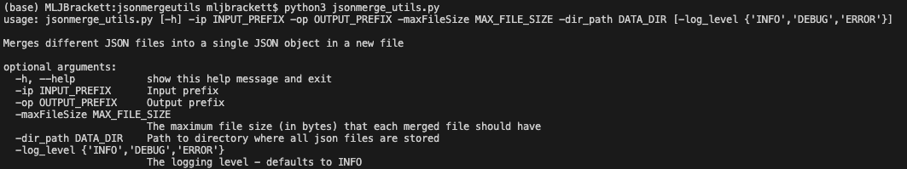
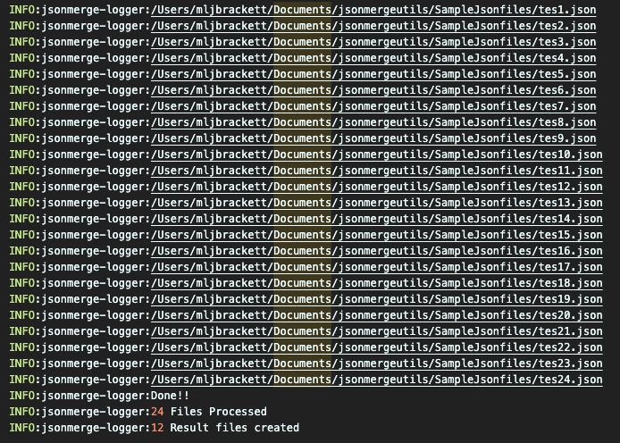

# jsonmergeutils 
  

 

Merges a series of files containing JSON array of Objects into a single file containing one JSON object.

Consider a file with name [tes1.json](SampleJsonfiles/tes1.json) with contents (Refer next section to know more about the arguments accepted):
```
{
	"states": [{
		"name": "Alabama",
		"abbreviation": "AL",
		"area_codes": ["205", "251", "256", "334", "938"]
	}, {
		"name": "Alaska",
		"abbreviation": "AK",
		"area_codes": ["907"]
	}]
}
```
and other file with same prefix but different number as suffix say [tes2.json](SampleJsonfiles/tes2.json) with contents:
```
{
	"states": [{
		"name": "Arizona",
		"abbreviation": "AZ",
		"area_codes": ["480", "520", "602", "623", "928"]
	}, {
		"name": "Arkansas",
		"abbreviation": "AR",
		"area_codes": ["479", "501", "870"]
	}]
}
```
the resultant file generated by merging [tes1.json](SampleJsonfiles/tes1.json) and [tes2.json](SampleJsonfiles/tes2.json) is:
```
{"states": [{"name": "Alabama", "abbreviation": "AL", "area_codes": ["205", "251", "256", "334", "938"]}, {"name": "Arkansas", "abbreviation": "AR", "area_codes": ["479", "501", "870"]}, {"name": "Alaska", "abbreviation": "AK", "area_codes": ["907"]}, {"name": "Arizona", "abbreviation": "AZ", "area_codes": ["480", "520", "602", "623", "928"]}]}
```
this file will be named according to the Output Prefix given by the user, [result1.json](SampleJsonfiles/result1.json) in this case.

## **Dependencies:**

* **os module**(builtin)
* **json module**(builtin)

* **jsonmerge module** [[link]](https://pypi.org/project/jsonmerge/)
```bash
pip install jsonmerge
```
* **genson module** [[link]](https://pypi.org/project/genson/)
```bash
pip install genson
```
## **Usage:**
* Download the repository and run the 'jsonmerge_utils.py' file from command line to display help.
```bash
python3 jsonmerge_utils.py
```


* **Accepts the following arguments :** 
  * **Input prefix:** The common prefix all file names share
  
    e.g. test in test1.json, test2.json, test3.json......
    
    The program will read all files in the Folder Path that begin with the Input File
    Base Name, and process them in increasing order of the number added as a
    suffix to each file (1,2,3,....,12,13,...).
   * **Output Prefix:** The program will ensure that the output files are named using the Output File
     Base Name as a prefix, and a counter as a suffix.
     
     e.g for output prefix 'merge' output files will be named as merge1.json, merge2.json, merge3.json.....
    * **Max File Size:** The maximum file size (**in bytes**) that each merged file should have.
    * **A Directory Path** to where the JSON files are stored
    * **Log Level:** The logging level that the user wants. More information can be found [here](https://docs.python.org/3/library/logging.html)
  
* _Can merge json files containing multiple root keys given that they are of type 'array'._ 

* _Since the merged json files are encoded in UTF-8, it can also support any unicode characters._

* _Removes Redundant json objects if any exist within the array._

To run the program specify the correct arguments
```bash
python 3 jsonmerge_utils.py -ip tes -op result -maxFileSize 600 -dir_path /Users/mljbrackett/Documents/jsonmergeutils/SampleJsonfiles -log_level INFO
```
The command above runs the program as such:
* Input Prefix = 'tes'
* Output Prefix = 'result'
* Max File Size = 600 bytes 
* Directory Folder = /Users/mljbrackett/Documents/jsonmergeutils/SampleJsonfiles **(Replace this with your directory)**
* Log Level = Info


The output log after a successful run will look like:


- Incase the merged files are to be stored in a separate folder change [line 101-103](jsonmerge_utils.py#L101) in [jsonmerge_utils](jsonmerge_utils.py)

from 
```python
merge = Merge(path_creator(args.data_dir, args.input_prefix),
                      path_creator(args.data_dir, args.output_prefix),
                      args.max_file_size)
```
to (Copy the code below and replace the code from [line 101-103](jsonmerge_utils.py#L101))
```python
merge = Merge(path_creator(args.data_dir, args.input_prefix),
                      path_creator(output_folder(args.data_dir), args.output_prefix),
                      args.max_file_size)
```
The program will create a 'MergedFiles' folder and store all the merged files in it.

### Algorithmic complexity O(n):

* The schema for json files to be merged needs to be generated and modified-
  * Generation of schema is done by genson module.
  * Modification of schema depends on number of root keys in json schema, if there is one key then time complexity is O(1). For more than one key it will be O(n). 
* The program has to iterate over the files which takes time complexity of O(n).
* Merging of json arrays is handled by jsonmerge module
* Calculating the size of json object takes O(1) time
* The function for checking redundant objects in json array takes O(2n). This function can be included in the program if the elimination of redundancy is desired, although doing this increases the time complexity of whole program to O(n^2).
  * Uncomment [line 95](merge_files.py#L95) from [merge_files.py](merge_files.py) to include this function.
  Or replace with the code below on [line 95](merge_files.py#L95)
  ```python
  self.redundant_obj()
  ```
  
### Limitations:
* Files will be merged only when the size of base file is less than the MAX FILE SIZE and the size of future merged json object is less than MAX FILE SIZE.
   i.e 
   
   For e.g. 
   
   A json file contains data of size 300 bytes, the json object from this json file will be referenced as **_head_**   
   
   and the **_base_** json object which has been formed by merging previous json files has size of 400 bytes 
   
   and the **_MAX FILE SIZE_** is 600 bytes
   
   So the size of base is less than MAX FILE SIZE, but if it were to be merged with head then the total size becomes 700 bytes which is more than the MAX FILE SIZE.
   
   The head will **not** be merged with base at all, not even partially.
   
   The base will be stored in a file which will have size 400 bytes and the **head** object will be made the **new base** object to be merged with next file.
* The output json file by default will not contain pretty json, since indentation increases the size of json file drastically.
  i.e a json file without indentation for e.g. is 240 bytes, with indentation of level 2 the file size will increase above 600 bytes.
